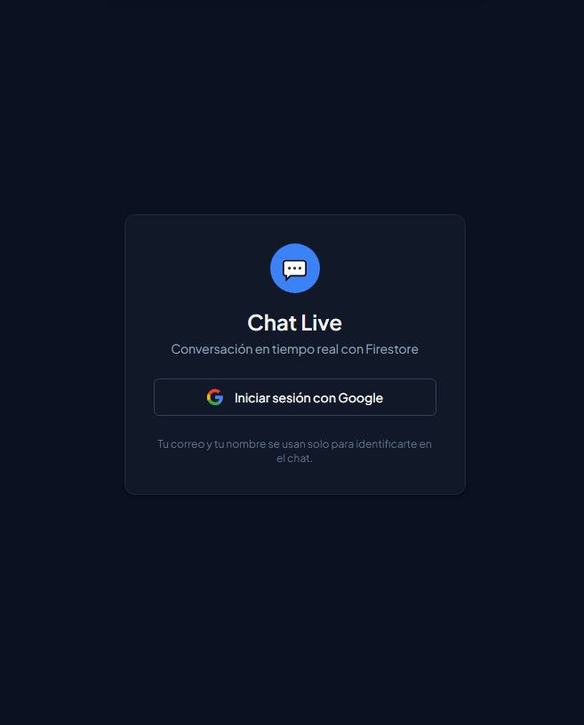
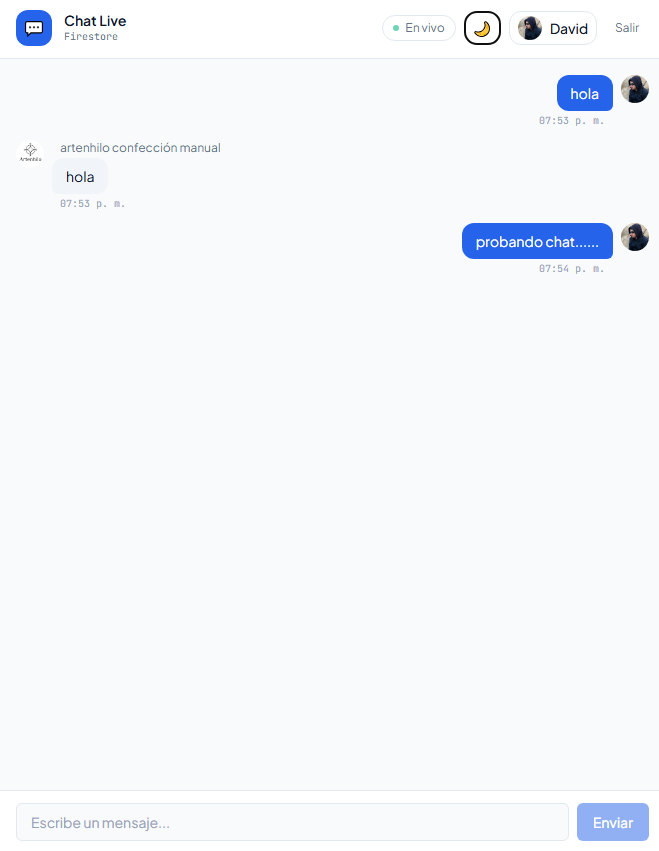
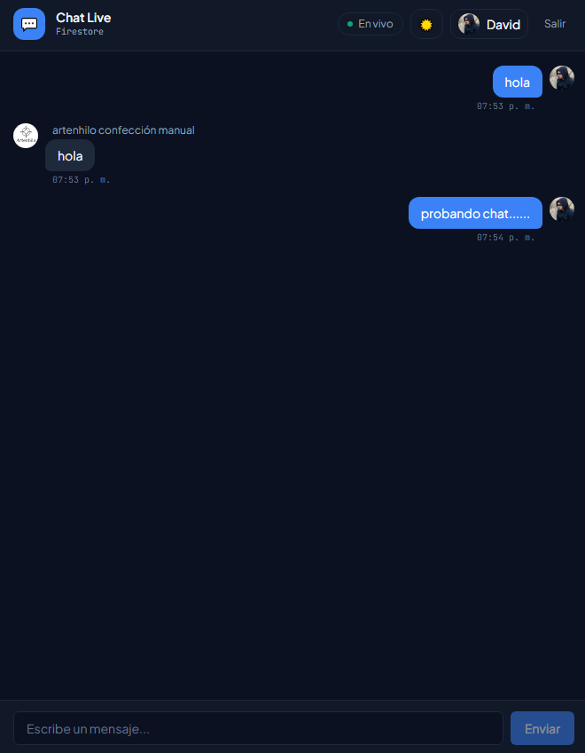
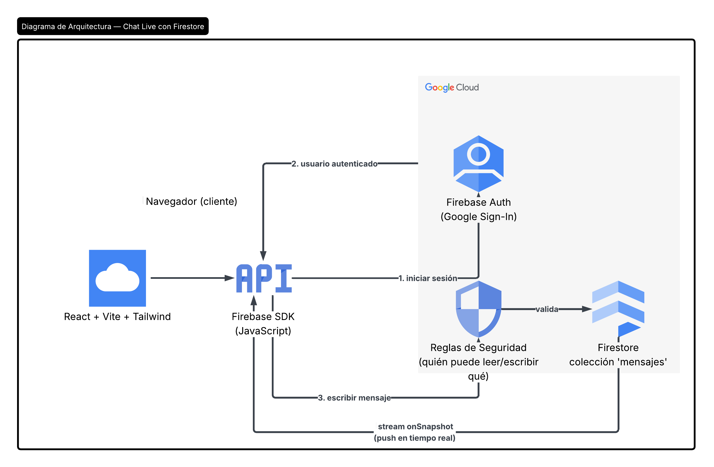
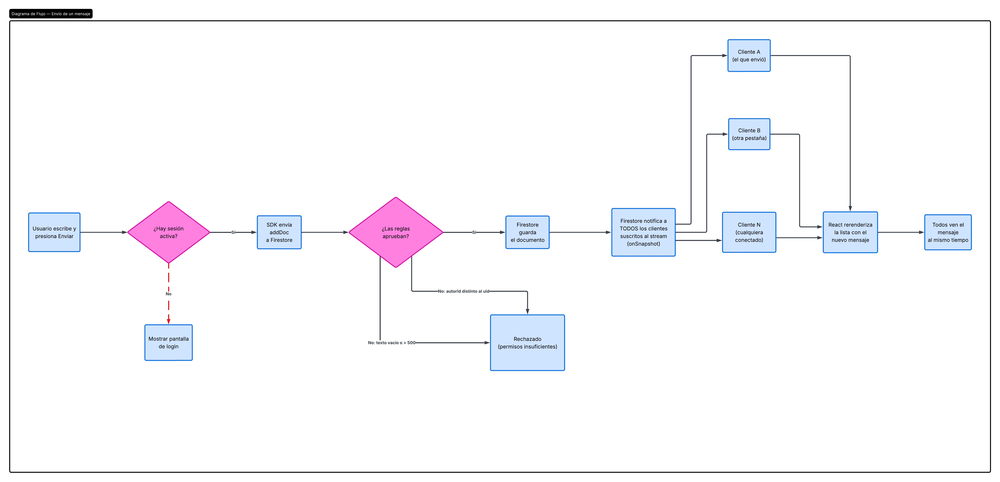
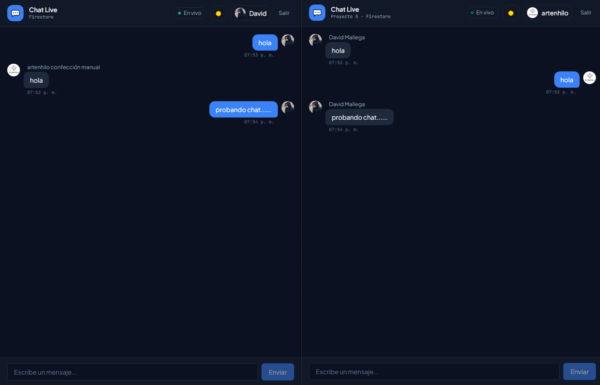
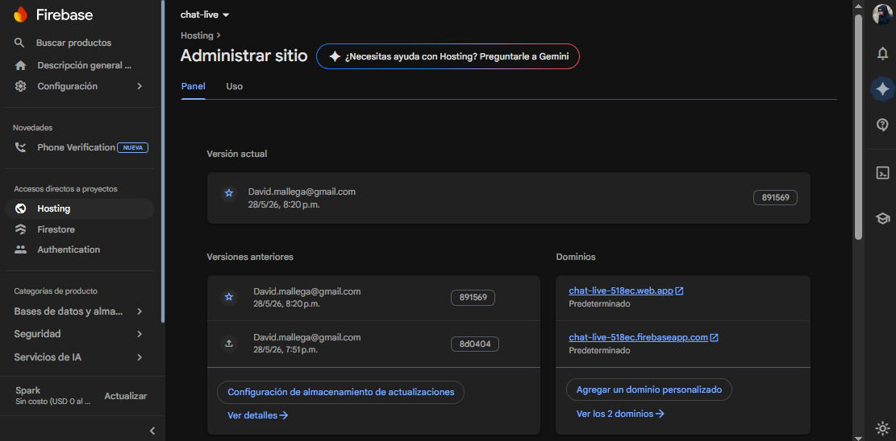
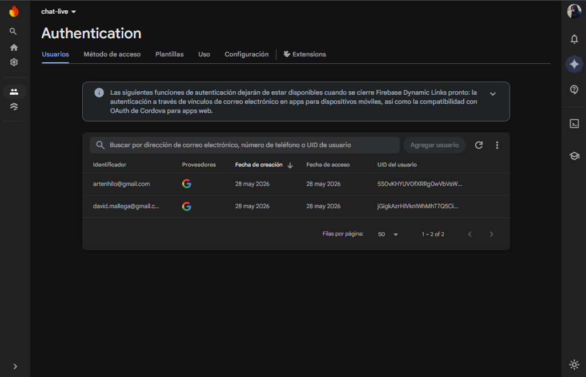
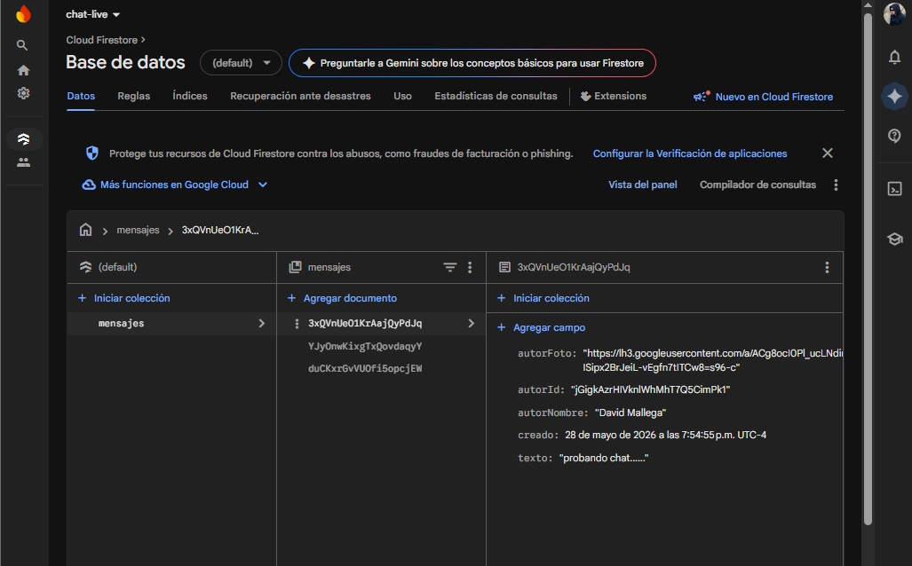
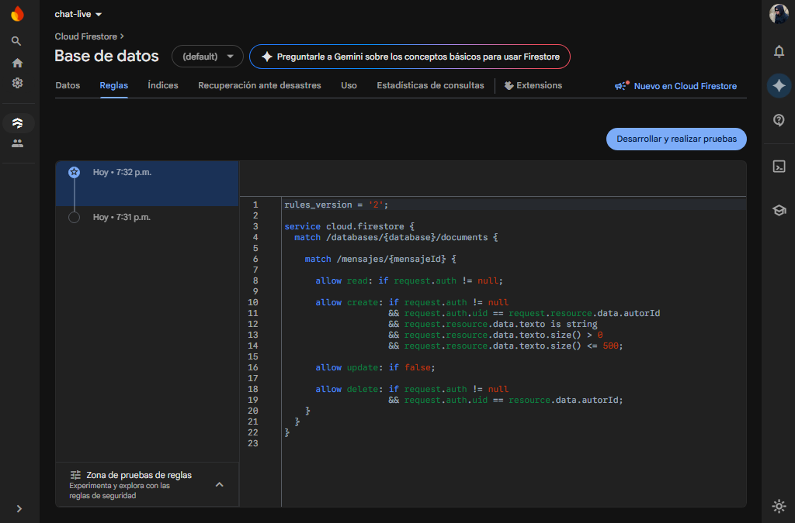

# Chat Live — Tiempo real con Firestore

Aplicación de chat fullstack desplegada en producción. Frontend React conectado directamente a Cloud Firestore mediante streams en tiempo real (`onSnapshot`). Sin backend — las Reglas de Firestore reemplazan al servidor.


---

## Vista previa

| Login | Chat modo claro | Chat modo oscuro |
|-------|----------------|-----------------|
|  |  |  |

---

## ¿Qué hace?

Sala de chat global con mensajes en tiempo real:

- **Login con Google** — un clic, sin formularios ni contraseñas
- **Mensajes en tiempo real** — aparecen al instante en todas las pestañas conectadas sin recargar
- **Borrar tus mensajes** — las reglas de Firestore impiden borrar los ajenos
- **Modo claro/oscuro** — detecta la preferencia del sistema

---

## Stack

| Capa | Tecnología |
|------|-----------|
| Frontend | React 18 · Vite · Tailwind CSS |
| Base de datos | Cloud Firestore (stream en tiempo real) |
| Autenticación | Firebase Auth (Google Sign-In) |
| Seguridad | Reglas de Firestore |
| Hosting | Firebase Hosting (CDN global) |

---

## Diagramas





---

## Arquitectura — sin backend

Este proyecto rompe el patrón de los anteriores: no hay Cloud Run, no hay API REST.

```
Proyectos 1-4:   React → Cloud Run (backend) → servicio GCP
Proyecto 5:      React → Firestore (directo)
```

El cliente abre un stream persistente con Firestore (`onSnapshot`) y recibe cambios empujados desde el servidor automáticamente. La validación y seguridad la implementan las **Reglas de Firestore** — ese archivo es el backend.

```
Navegador (React SPA)
    ├── Firebase Auth ──── Google Sign-In (OAuth)
    └── Cloud Firestore ── onSnapshot (stream en tiempo real)
                               └── firestore.rules (valida quién lee/escribe)
```

---

## Evidencia de despliegue

### Dos pestañas sincronizadas en tiempo real



### Firebase Hosting activo



### Firebase Auth — usuarios registrados



### Firestore — colección mensajes



### Reglas de seguridad publicadas



---

## Estructura

```
05-chat/
├── src/
│   ├── services/
│   │   ├── firebase.js           Inicialización del SDK
│   │   ├── auth.js               Login/logout con Google
│   │   └── mensajes.js           onSnapshot + addDoc + deleteDoc
│   ├── hooks/
│   │   ├── useUsuario.js         Suscripción al estado de sesión
│   │   ├── useMensajes.js        Stream de mensajes conectado a React
│   │   └── useTema.js            Toggle dark mode
│   ├── components/
│   │   ├── PantallaLogin.jsx     Vista sin sesión
│   │   ├── Cabecera.jsx          Avatar, tema, logout
│   │   ├── ListaMensajes.jsx     Stream con autoscroll
│   │   ├── Mensaje.jsx           Burbuja individual
│   │   └── FormularioMensaje.jsx Input y envío
│   └── App.jsx
├── firebase/
│   └── firestore.rules           Reglas de seguridad (reemplazan al backend)
└── docs/
    └── img/
```

---

## Correr en local

```bash
npm install
cp .env.example .env   # pega las claves de Firebase Console
npm run dev            # http://localhost:5173
```

Las claves de Firebase se obtienen en: **Firebase Console → Configuración del proyecto → Tus apps → Web**.

---

## Despliegue en Firebase Hosting

```bash
npm install -g firebase-tools
firebase login
firebase init hosting  # public: dist, SPA: yes
npm run build
firebase deploy --only hosting
```

También hay que publicar las reglas de Firestore:
- Firebase Console → Firestore Database → Reglas → pegar `firebase/firestore.rules` → Publicar

---

## Reglas de seguridad (firestore.rules)

```
match /mensajes/{mensajeId} {
  allow read:   if request.auth != null;
  allow create: if request.auth != null
                && request.auth.uid == request.resource.data.autorId
                && request.resource.data.texto.size() > 0
                && request.resource.data.texto.size() <= 500;
  allow update: if false;
  allow delete: if request.auth != null
                && request.auth.uid == resource.data.autorId;
}
```

---

## Decisiones técnicas

- **Sin backend**: `onSnapshot` requiere conexión directa cliente↔Firestore. Un servidor intermedio rompería el stream en tiempo real.
- **Google Sign-In**: delega la gestión de credenciales a Google — sin contraseñas que gestionar ni tokens que renovar manualmente.
- **`serverTimestamp()`**: garantiza el orden global de mensajes usando el reloj del servidor, no el del cliente.
- **`allow update: if false`**: los mensajes son inmutables. Simplifica la UX y evita ediciones maliciosas.
- **Firebase Hosting vs Cloud Run**: para una SPA estática, Hosting es más rápido (CDN global) y más barato que levantar un contenedor.
- **Limpieza de listeners**: `useMensajes` devuelve la función `desuscribir` en el return del `useEffect` para cerrar el stream al desmontar el componente.
